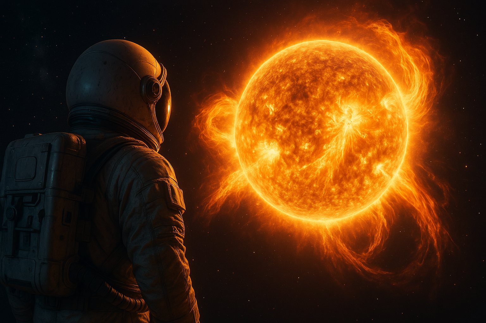

O áudio gerado está aqui: [áudio](./output/podcast.mp3). Acesse o readme do desafio proposto aqui: [Desafio DIO.](./README.MD)

# 🎙️ Podcast: O Gênesis Algorítmico

Fala, pessoal! Neste repositório, apresento um breve resumo sobre os temas do curso "Microsoft 50 anos" da dio.me, definindo o que é um prompt, como criar bons prompts e técnicas que auxiliam na obtenção de resultados mais precisos da IA.

Utilizaremos duas IAs generativas: ChatGPT e Microsoft Copilot. Antes de avançar, é importante definir alguns conceitos:

# 🤖 O que é uma inteligência artificial?

Inteligência Artificial (IA) é uma área da ciência da computação dedicada à criação de sistemas capazes de executar tarefas que normalmente exigiriam inteligência humana. Isso inclui raciocínio, tomada de decisões autônoma, reconhecimento de padrões e até a geração de conteúdos — como textos, imagens, músicas e códigos.

# 🧠 Tipos de IA

Basicamente, existem dois tipos de IA: a forte e a fraca:

- **IA fraca:** Executa apenas tarefas específicas para as quais foi treinada, não podendo realizar nada fora desse escopo. Exemplos são sistemas de recomendação da Netflix, assistentes virtuais como Siri e engines de xadrez.

- **IA forte:** A tão sonhada AGI — uma IA com capacidade cognitiva comparável à humana, capaz de aprender qualquer tarefa intelectual — ainda não foi alcançada. No entanto, já existem sistemas impressionantes que se aproximam dessa ideia, como ChatGPT, Gemini e Qwen. Esses modelos são treinados com grandes volumes de dados e conseguem desempenhar diversas tarefas, como conversar, escrever código, traduzir idiomas, gerar imagens, entre outras. Embora ainda sejam consideradas IAs estreitas em termos técnicos, sua versatilidade representa um avanço significativo rumo à AGI.

# 🛠️ Engenharia de prompt

Com a popularização das IAs generativas, qualquer pessoa pode interagir com modelos avançados como ChatGPT ou Gemini. Por isso, torna-se essencial saber como se comunicar adequadamente com essas IAs.

A engenharia de prompt é um campo focado em escrever instruções claras, diretas e otimizadas, com o objetivo de extrair respostas mais precisas, úteis e alinhadas ao que se deseja.

A seguir, apresento algumas das principais técnicas para criar prompts mais eficazes e obter o máximo desempenho dos modelos de linguagem:

## 🚀 Zero-shot prompting

Com a vasta base de dados usada no treinamento das LLMs, surgiu a técnica zero-shot, na qual não se fornece nenhum exemplo para o modelo, apenas a tarefa a ser executada.

```txt
Classifique a seguinte frase em positivo, negativo ou neutro.
Frase: Já é a quinta vez que falo isso!
Sentimento:
```

Saída do modelo:

```txt
Sentimento: Negativo
```

O zero-shot é útil quando a tarefa solicitada é simples. Para tarefas mais complexas, é recomendado usar as técnicas seguintes.

## 🎯 Few-shot prompting

Em tarefas mais complexas, é necessário fornecer mais contexto ao modelo para melhorar seu desempenho. O few-shot consiste basicamente em fornecer alguns exemplos para orientar o modelo e direcioná-lo ao resultado esperado.

```txt
Reescreva a seguinte frase toda em maiúsculas.

Exemplo: hello world  
Saída: HELLO WORLD

Frase: Olá mundo  
Saída:
```

Saída do modelo:

```txt
OLÁ MUNDO
```

## 🧩 Chain-of-Thought prompting

Essa técnica consiste em solicitar um passo a passo do processo de formulação da resposta pela IA, ou seja, o raciocínio utilizado pelo modelo. É comumente utilizada para transformar tarefas e assuntos complexos em uma série de etapas mais claras e compreensíveis.

```txt
Explique passo a passo como dividir um átomo.
```

## 🔄 Self-consistency

Aqui, são solicitadas várias soluções para um problema. Depois de fornecidas, escolhe-se a resposta mais consistente para a resolução.

```txt
Forneça 5 formas de reescrever o código x.
```

## 📚 Geração com recuperação aprimorada (RAG)

Em contextos nos quais a IA precisa de uma grande quantidade de informações para atender às solicitações, é útil utilizar a RAG (geração com recuperação aprimorada), onde o modelo tem acesso a fontes adicionais de conhecimento para executar a tarefa.

### 🎨 Engenharia de prompt e geração de imagens

As técnicas de engenharia de prompt no contexto das imagens e videos podem mudar bastante de acordo com o modelo, como o midjourney. 

Para explorar o tema dessa seção vamos usar o Copilot da microsoft. O prompt será:

```txt
astronaut watching a coronal mass ejection, sun, space, stars, cinematic, 8k, unreal engine --ar 16:9 --q 2 --v 4
```

Resultado:




## Fontes para aprofundamento

Bem, pessoal, deixarei aqui algumas fontes legais sobre os assuntos abordados, espero que tenham gostado!

- [📘 Técnicas de engenharia de prompt de imagem – Microsoft Azure OpenAI](https://learn.microsoft.com/pt-pt/azure/ai-services/openai/concepts/gpt-4-v-prompt-engineering)  
- [🎯 Engenharia de prompt: o que é e por que importa – IBM Brasil](https://www.ibm.com/br-pt/think/topics/prompt-engineering)  
- [🧪 14 Técnicas essenciais de engenharia de prompt – LinkedIn](https://www.linkedin.com/pulse/engenharia-de-prompt-14-t%C3%A9cnicas-essenciais-para-melhorar-silva-vmrzf)  
- [🎨 53 melhores prompts para gerar imagens com IA – Showmetech](https://www.showmetech.com.br/melhores-prompts-para-gerar-imagens-com-ia/)  
- [✨ 50 prompts para criar imagens incríveis com IA – Blog da Pareto](https://blog.pareto.io/prompts-para-criar-imagem-com-ia/)  
- [📷 Melhores práticas para criar prompts de imagem – Roberto Dias Duarte](https://www.robertodiasduarte.com.br/melhores-prati)
